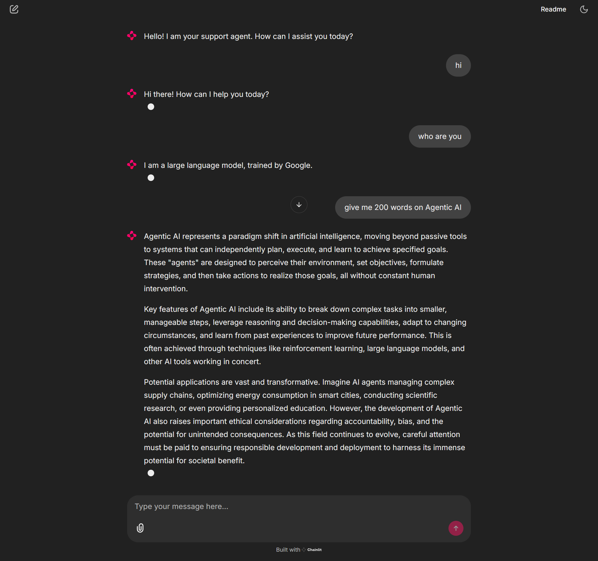

# Chainlit Streaming Chatbot

This project demonstrates a streaming chatbot implementation using Chainlit and the OpenAI SDK, with support for Gemini API integration. The chatbot provides real-time responses with a clean user interface and message history management.

For more detail, check below repo link

[step 07 streaming](https://github.com/panaversity/learn-agentic-ai/tree/main/01_ai_agents_first/07_streaming)

## Features

- Real-time message streaming
- Message history management
- Clean and intuitive user interface
- Integration with Gemini API through OpenAI-compatible endpoint
- Async support for better performance

## Screenshot



## Prerequisites

- Python 3.x
- Gemini API key
- Required Python packages (specified in pyproject.toml)

## Setup

1. Clone the repository
2. Create a `.env` file in the root directory and add your Gemini API key:
   ```
   GEMINI_API_KEY=your_api_key_here
   ```
3. Install dependencies using your preferred package manager

## Project Structure

```
streaming/
├── main.py          # Main application code
├── chainlit.md      # Chainlit configuration
├── pyproject.toml   # Project dependencies
└── assets/
    └── screenshot.png   # UI screenshot
```

## Key Components

### Provider Setup
- Initializes OpenAI provider with Gemini API configuration
- Uses custom base URL for Gemini API compatibility

### Model Configuration
- Uses `gemini-2.0-flash` model
- Configured through OpenAIChatCompletionsModel

### Agent Configuration
- Custom support agent with configurable instructions
- Stateful chat history management
- Streaming response capability

## Running the Application

To start the chatbot:

```bash
chainlit run main.py
```

The application will start and be available in your web browser.

## Features Explanation

1. **Chat Initialization**: 
   - Initializes empty chat history on start
   - Displays welcome message

2. **Message Handling**:
   - Maintains conversation history
   - Streams responses in real-time
   - Updates chat history after each interaction

3. **Streaming Responses**:
   - Real-time token-by-token response display
   - Smooth user experience with no delay

## Contributing

Feel free to contribute to this project by submitting issues or pull requests.

## License

This project is open source and available under the MIT License.