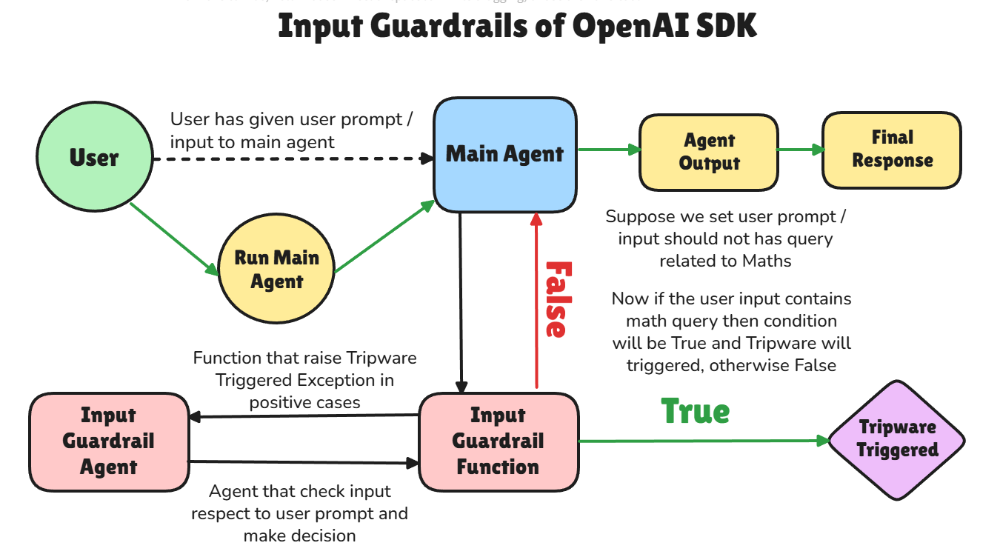
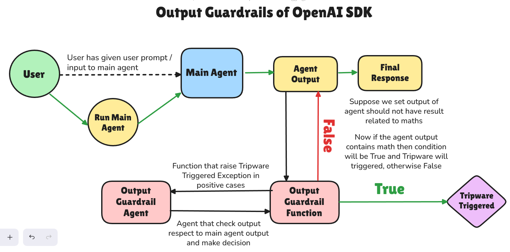

## **Guardrails**

### 1) Input Guardrail

### 2) Output Guardrail

### Important `Classes & Functions` of Guardrail

1) GuardrailFunctionOutput
2) InputGuardrailTripwireTriggered
3) OutputGuardrailTripwireTriggered
4) input_guardrail
5) output_guardrail
6) InputGuardrailResult
7) OutputGuardrailResult
8) InputGuardrail
9) OutputGuardrail