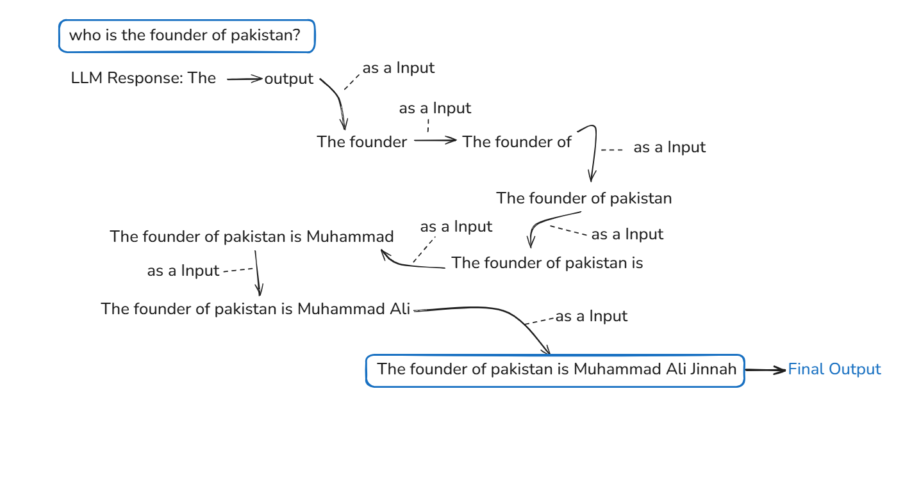

#  Prompt Engineering & Context Engineering

##  What is Prompt Engineering?

**Prompt Engineering** is both a creative and technical process focused on designing effective instructions that help AI models deliver accurate and relevant results.  
In simpler terms, it’s about learning how to “talk” to AI systems in a way that makes them perform exactly what you want.

##  What is Context Engineering?

**Context engineering** is both a strategic and technical process focused on designing and managing the background information, data, and conditions that shape how AI models interpret and respond to prompts.
In simpler terms, it’s about setting up the environment or knowledge base that helps AI understand the situation before it’s asked to perform a task.

**🧱 Prompt engineering** = “What you ask.”

**🌐 Context engineering** = “What the AI already knows when you ask.”

---

## Why It Matters

- You don’t have to be a coder to use AI smartly  
- A strong prompt can completely change how well the AI performs  
- It’s a skill that gets better the more you practice  
- It’s now a core ability for professionals across many industries  

---

## Prompt Engineering vs. Context Engineering

| **Aspect** | **Prompt Engineering** | **Context Engineering** |
|-------------|------------------------|--------------------------|
| **Goal** | Tell the model what to do and how to respond | Provide the model with relevant facts, data, or examples |
| **Focus Areas** | Wording, structure, tone, format, rules, sample outputs | Documents, databases, retrieval systems, APIs, Tools and memory |
| **Common Adjustments** | “Answer briefly and return valid JSON.” | “Include the updated company policy and glossary in context.” |
| **Common Issues** | Unclear wording → confusing output | Missing info → outdated or incorrect response |
| **Managed By** | Prompt/UX Designers, Developers | Data and ML Engineering Teams |

---

###  How They Work Together

1. **Start with the prompt** — define what you want, the format, and constraints (e.g., “return JSON format”).  
2. **Add the context** — attach only the most useful and related data or examples.  

---

## Quick Tips

- Keep prompts short and specific  
- Use structured outputs (JSON, tables, bullet points)  
- Add few-shot examples only when they generalize  
- For factual tasks, attach verified documents  
- Evaluate prompts and retrieval separately  

> **Summary:**  
>  Prompting is *how* you ask.  
>  Context is *what* you show.  
>  Combine both for smart and consistent AI results.

---

# Understanding Large Language Models (LLMs)

## How LLMs Work (The Basics)
Large Language Models (LLMs) are **powerful text prediction systems** trained on huge amounts of data.  
They don’t think like humans — instead, they follow patterns they’ve learned from text across books, websites, and conversations.

### Step-by-Step Process

1. **Input (Your Prompt):**  
   You give the model some text — for example, you type *“Write a short email to my teacher”*.

2. **Prediction:**  
   The model doesn’t “know” what an email is, but it has seen millions of examples of emails during training.  
   So it predicts the next most likely word — maybe *“Hello,”* — then the next one — *“I hope you’re doing well,”* — and keeps going.

3. **Autocompletion in Action:**  
   Just like your phone suggests the next word when you’re texting, LLMs do the same thing — but at a much larger and smarter scale.  
   For instance, if you start typing *“Once upon a time”*, it will likely continue with something like *“there was a little girl who…”* because that’s a common pattern it has learned.

4. **Patterns, Not Facts:**  
   LLMs don’t “understand” the world the way humans do. They rely on probabilities — what *usually* comes next based on patterns in their data.  
   Example: If you ask it about “the capital of France,” it answers “Paris” not because it *knows*, but because “capital of France → Paris” is a strong pattern it has seen thousands of times.

---

## Real-World Example
Imagine you’re using ChatGPT to write a social media caption.  
You type:  
> “Write a short, friendly caption about my new coffee mug.”

The model predicts what kind of words usually follow — something like:  
> “Starting my morning right  Love this new mug!”  

It doesn’t know you personally or your mug — it’s just using its training to guess what a good caption might look like based on similar examples.

---

The model’s next output token is added to the previous input tokens and used as the new input, repeating this process until the complete response is generated. This whole process is called `Progressive Model`

---

## Key Model Settings

### Temperature (0–1)

Controls creativity and randomness:

| Range | Behavior |
|--------|-----------|
| **Low (0–0.3)** | Logical, precise, repeatable |
| **Medium (0.4–0.7)** | Balanced between logic and imagination |
| **High (0.8–1.0)** | Creative and expressive but less stable |

**Use Cases:**
- `0`: For math or factual data  
- `0.7`: For blog writing or brainstorming  
- `0.9`: For poetry or storytelling  

---

###  Output Length / Token Limit
Defines maximum response length.  
More tokens = longer responses = higher compute cost.

---

### Top-K & Top-P Sampling
- **Top-K:** Considers only top *K* likely words  
- **Top-P (nucleus):** Picks words until a probability threshold is reached  

Together with *temperature*, they shape creativity and control.

| Type | Temperature | Top-P | Top-K |
|------|--------------|-------|-------|
| Safe | 0.1 | 0.9 | 20 |
| Balanced | 0.3 | 0.95 | 30 |
| Creative | 0.9 | 0.99 | 40 |

---

# Core Prompting Techniques

## Zero-Shot Prompting
In this technique, you ask the model a question **without giving any examples**.  
The AI uses its own knowledge to generate an answer.  

**Example:**  
> “Summarize this text in one line: ‘The new phone has a long battery life, better camera, and faster processor.”

**Model Output:**  
> “A high-performance phone with great battery and camera quality.” 

**Use When:**  
- The task is simple and clear.  
- The model doesn’t need to learn from a pattern.  

---

## One-Shot Prompting  
In this technique, you give **one example** so the AI can understand what kind of answer you expect.  
It’s helpful when you want a specific **style or pattern** in the output.  

**Example:**  
> Convert a short sentence into a question.  
> Example: “You like pizza.” → “Do you like pizza?”  
>   
> Now: “You play football.” →

**Model Output:**  
> “Do you play football?”

**Use When:**  
- You want to teach the model a pattern with one sample.  
- The task has a simple rule that should be followed.  

---

## Few-Shot Prompting  
In this technique, you give **multiple examples (3–5)** so the AI can easily learn the pattern and continue it correctly.  
It’s useful when the task needs **clear context or consistent formatting**.  

**Example:**  
> Change each sentence into the past tense.  
>   
> Example 1: “I play cricket.” → “I played cricket.”  
> Example 2: “She goes to school.” → “She went to school.”  
> Example 3: “They eat breakfast.” →  

**Model Output:**  
> “They ate breakfast.”

 **Use When:**  
- The model needs to **learn a pattern clearly**.  
- You want **consistent style or structure** in the output.  

---

## Advanced Prompting Strategies

### Master CoT (Chain of Thoughts) & ToT (Tree of Thoughts) Prompting

Beginner-friendly intro to **Chain of Thought (CoT)** and **Tree of Thoughts (ToT)**—prompting tricks to make AI think better. Like step-by-step guides for AI brains.

Covers: Explanations, benefits, when to use, use cases, concepts.

### Chain of Thought (CoT)

Break problems into steps. Prompt: "Think step by step."

**How**: AI chains reasoning: Step 1 → Step 2 → Answer.

**Benefits**:
- Improves accuracy 20-50% on logic/math.
- Easy—no code needed.

**When**: Logic tasks, like math. Skip simple questions.

**Use Case**:
- Problem: I want to make a biryani give me the recipe, let's do with step by step
- Prompt: "...Think step by step."

### Tree of Thoughts (ToT)

Like CoT with branches. Explore multiple paths, pick best.

**How**: Prompt AI to generate 2-3 ideas per step, evaluate, expand winner.

**Benefits**:
- 70% better on complex puzzles.
- Boosts creativity; self-corrects.

**When**: Creative/open tasks, like planning. Skip facts.

**Use Case**:
Problem: give me sales strategies for shirt marketing, with ToT (tree of thoughts)

### Comparison

| Feature     | CoT                     | ToT                     |
|-------------|-------------------------|-------------------------|
| Structure  | Linear steps           | Branching paths        |
| Best For   | Logic/math             | Creative puzzles       |
| Effort     | Low                    | Medium                 |
| Speed      | Fast                   | Slower, smarter        |

