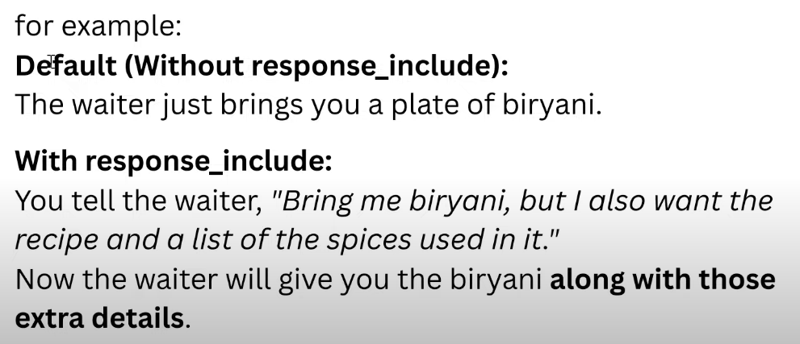
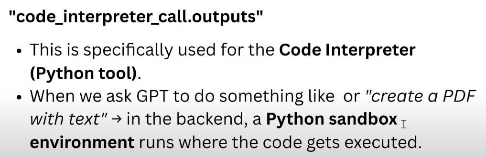
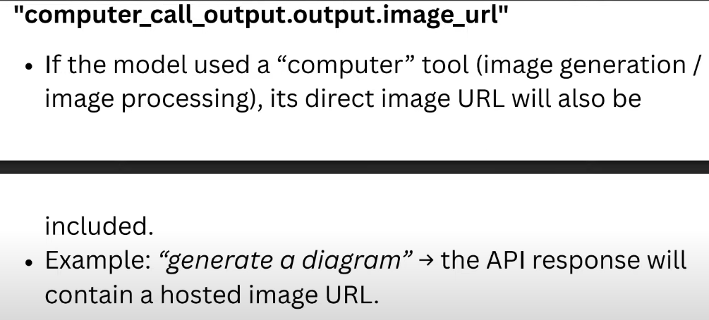
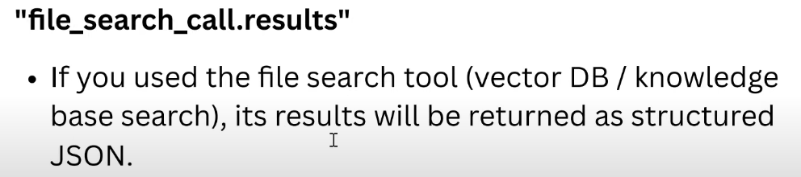
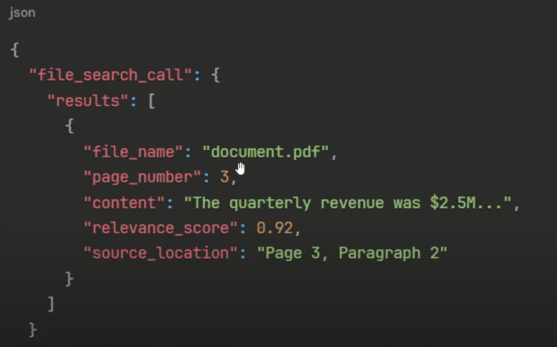
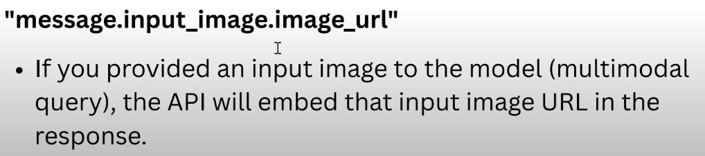
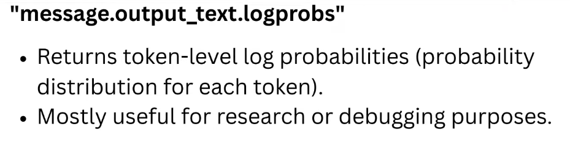
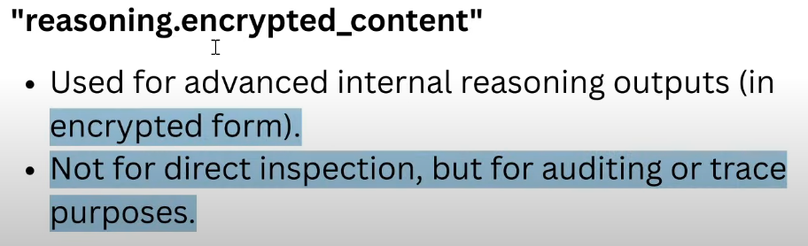

## **Model Setting Cont.**

- `max-token:`
- `reasoning:`
- `metadata:` 
    - For tracing and debugging, go to [log](https://platform.openai.com/logs), enter your key and value of your metadata to search it.
- `store:` 
    - Whether to store or not agent run detail on log
- `include_usage:`
- `response_include:`
    
    

    - **code_interpreter_call.outputs**
    

    - **computer_call_output.output.image_url**
    

    - **file_search_call.results**
    

        * **Example**
        

    - **message.input_image.image_url**
    

    - **message.output_text.logprobs**
    

    - **reasoning.encrypted_content**
    

- `resolve (method):`
- `to_json_dict(method):`