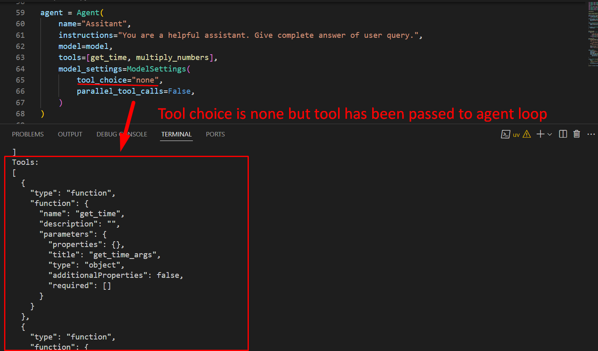
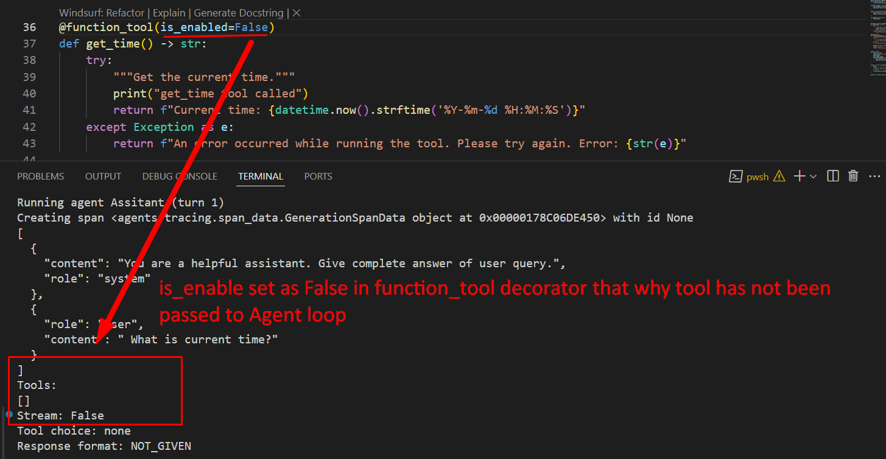

***We have discussed below topics in this session***

* **function_tool (decorator)**
    - **`failure_error_function:`**

* **Model Setting**
    - **`tool choice:`** 
        * Either you can select `auto`, `required` or `none`and you can also write `tool name` here to called specific tool
        * The different between **model setting** attribute of `tool_choice` and function_tool decorator of is_enable is:
            * In tool_choice option, tools have been passed to agent loop but LLM doesnt use them
                
            ---
            * But in is_enabled option, tools have not been passed to agent loop.
                
    
    - **`parallel tool calls`**
        * Only run if we have OpenAI API
        * Suppose, if `parallal_tool_calls` is set as False and we have 2 tools to run then total turns will be 3:
            - first tool run
            - second tool run
            - LLM run and generated answer

* **Agent**
    - **`tool_use_behavior:`**
        * **`"run_llm_again":`** The default behavior. Tools are run, and then the LLM receives the results
            and gets to respond.
        * **`"stop_on_first_tool":`** The output from the first tool call is treated as the final result.
            In other words, it isn’t sent back to the LLM for further processing but is used directly
            as the final output.
        * **`StopAtTools (class):`** A list of tool names, any of which will stop the agent from running further.
            The final output will be the output of the first matching tool call. The LLM does not process the result of the tool call
        * **`TooltoFinalOutputFunction (callable):`**

            ```python
                ToolsToFinalOutputFunction: TypeAlias = Callable[
                    [RunContextWrapper[TContext], list[FunctionToolResult]],
                    MaybeAwaitable[ToolsToFinalOutputResult],
                ]
            ```

            * **`ToolsToFinalOutputResult:`**
                - `is_final_output: bool` ==> Whether this is the final output. If False, the LLM will run again and receive the tool call output.
                - `final_output: Any | None = None` ==> The final output. Can be None if `is_final_output` is False,otherwise must match the `output_type` of the agent.
            
            * **`FunctionToolResult:`**
                - `tool: FunctionTool` ==> The tool that was run.
                - `output: Any` ==> The output of the tool.
                - `run_item: RunItem` ==>The run item that was produced as a result of the tool call.
    
    * **`reset_tool_choice: bool = True`**
    Whether to reset the tool choice to the default value after a tool has been called. Defaults
    to True. This ensures that the agent doesn't enter an infinite loop of tool usage.

