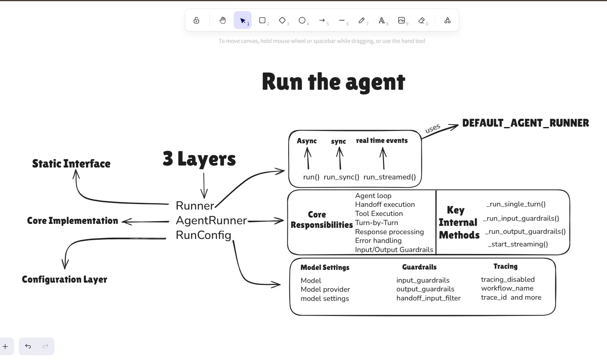

# **Runner**

1) ### **Class: AgentRunner**
    * **run method**
        - **RunOptions** `(Keword argument class)`
            - **context:** NotRequired[TContext | None]
                """The context for the run."""

            - **max_turns:** NotRequired[int] ==> """The maximum number of turns to run for."""

            - **hooks:** NotRequired[RunHooks[TContext] | None] ==> """Lifecycle hooks for the run."""

            - **run_config:** NotRequired[RunConfig | None] ==> """Run configuration."""

            - **previous_response_id:** NotRequired[str | None] ==> """The ID of the previous response, if any."""

            - **conversation_id:** NotRequired[str | None] ==> """The ID of the stored conversation, if any."""

            - **session:** NotRequired[Session | None] ==> """The session for the run."""
