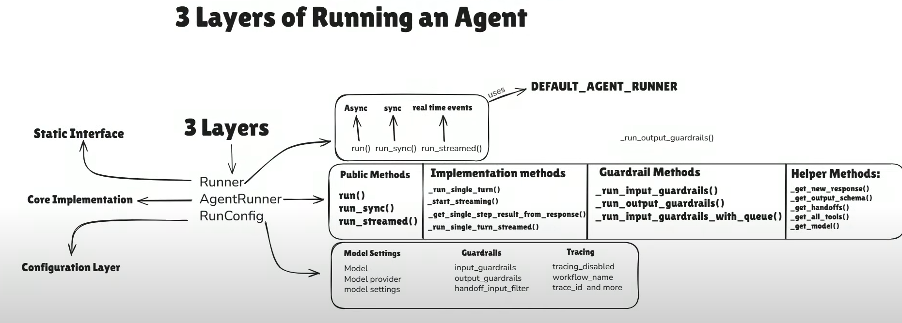

# **Runner**

1) ### **Class: AgentRunner**
    * **run method**
        - **RunOptions** `(Keword argument class)`
            - **context:** NotRequired[TContext | None]
                """The context for the run."""

            - **max_turns:** NotRequired[int] ==> """The maximum number of turns to run for."""

            - **hooks:** NotRequired[RunHooks[TContext] | None] ==> """Lifecycle hooks for the run."""

            - **run_config:** NotRequired[RunConfig | None] ==> """Run configuration."""

                - class **`RunConfig`**:
                    
                    * Configures settings for the entire agent run.

                    - **model:** str | Model | None = None

                        * The model to use for the entire agent run. If set, will override the model set on every agent. The model_provider passed in below must be able to resolve this model name.

                    - **model_provider:** ModelProvider = field(default_factory=MultiProvider)

                        * The model provider to use when looking up string model names. Defaults to OpenAI.

                    - **model_settings:** ModelSettings | None = None

                        * Configure global model settings. Any non-null values will override the agent-specific model settings.

                    - **handoff_input_filter:** HandoffInputFilter | None = None

                        * A global input filter to apply to all handoffs. If `Handoff.input_filter` is set, then that
                        will take precedence. The input filter allows you to edit the inputs that are sent to the new
                        agent. See the documentation in `Handoff.input_filter` for more details.

                    - **input_guardrails:** list[InputGuardrail[Any]] | None = None

                        * A list of input guardrails to run on the initial run input.

                    - **output_guardrails:** list[OutputGuardrail[Any]] | None = None

                        * A list of output guardrails to run on the final output of the run.

                    - **tracing_disabled: bool = False**

                        * Whether tracing is disabled for the agent run. If disabled, we will not trace the agent run.

                    - **trace_include_sensitive_data:** bool = field(
                        default_factory=_default_trace_include_sensitive_data
                        )
                        
                        * Whether we include potentially sensitive data (for example: inputs/outputs of tool calls or LLM generations) in traces. If False, we'll still create spans for these events, but the sensitive data will not be included.
                    

                    - **workflow_name:** str = "Agent workflow"
                        
                        * The name of the run, used for tracing. Should be a logical name for the run, like "Code generation workflow" or "Customer support agent".

                    - **trace_id:** str | None = None
                        
                        * A custom trace ID to use for tracing. If not provided, we will generate a new trace ID.

                    - **group_id:** str | None = None
                        
                        * A grouping identifier to use for tracing, to link multiple traces from the same conversation or process. For example, you might use a chat thread ID.

                    - **trace_metadata:** dict[str, Any] | None = None
                        
                        * An optional dictionary of additional metadata to include with the trace.

                    - **session_input_callback:** SessionInputCallback | None = None
                        
                        * Defines how to handle session history when new input is provided.
                            - `None` (default): The new input is appended to the session history.
                            - `SessionInputCallback`: A custom function that receives the history and new input, and returns the desired combined list of items.
                    

                    - **call_model_input_filter:** CallModelInputFilter | None = None

                        * Optional callback that is invoked immediately before calling the model. It receives the current agent, context and the model input (instructions and input items), and must return a possibly modified `ModelInputData` to use for the model call.

                    This allows you to edit the input sent to the model e.g. to stay within a token limit.
                    For example, you can use this to add a system prompt to the input.
                    

            - **previous_response_id:** NotRequired[str | None]
                * The ID of the previous response, if any.

            - **conversation_id:** NotRequired[str | None] 
                * The ID of the stored conversation, if any.

            - **session:** NotRequired[Session | None] 
                * The session for the run.
