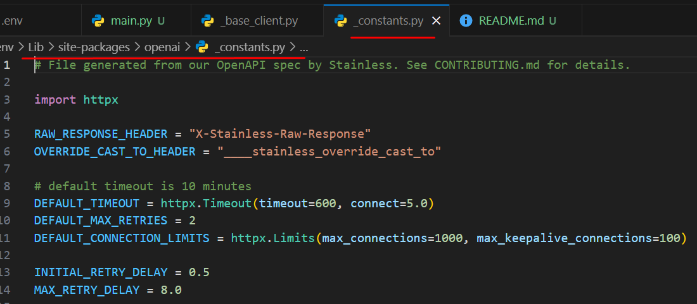

**Base Client** (.venv\Lib\site-packages\openai\_base_client.py), all error comes from this base client file.
**Constants** (.venv\Lib\site-packages\openai\_constants.py), has detail about the timeouts, retries etc.

- Below is the code of Contants.py

- Below is the output when `connection failed`

- Below is `flowchart of connection error`
